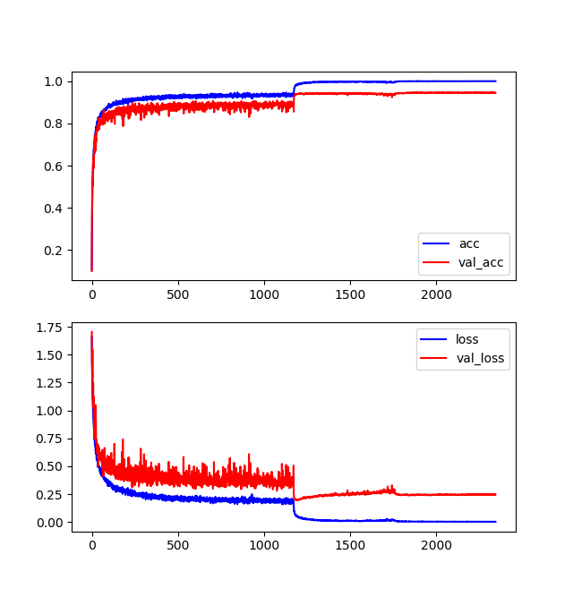

# densenet_cifar10_pytorch

> author:	tinyalpha	
>
> email:	tinyalpha@protonmail.com

### training

* run `python3 train.py` 
* you are suggested to replace the *means & stdevs* of training data with yours (compute them using `mean.py`)
* it takes several hours to train on a titan x (pascal)
* there are weights and logs I have trained in `bak` folder

### results

* it can get at most 94.73% / mean 94.51% on the validation set (compare to 94.76% in origin paper [origin paper](https://arxiv.org/pdf/1608.06993.pdf) with same setup)

* training curve is shown below:

  

### dependency

* python 3+
* pytorch 0.4.0
* matplotlib (for `plot.py`)